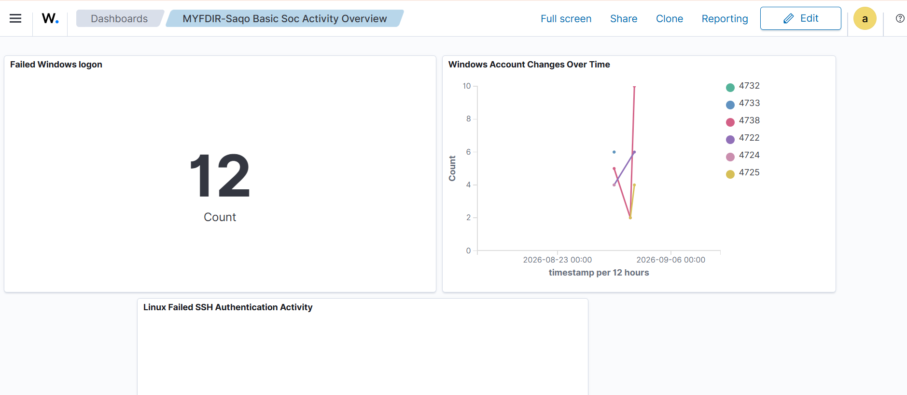
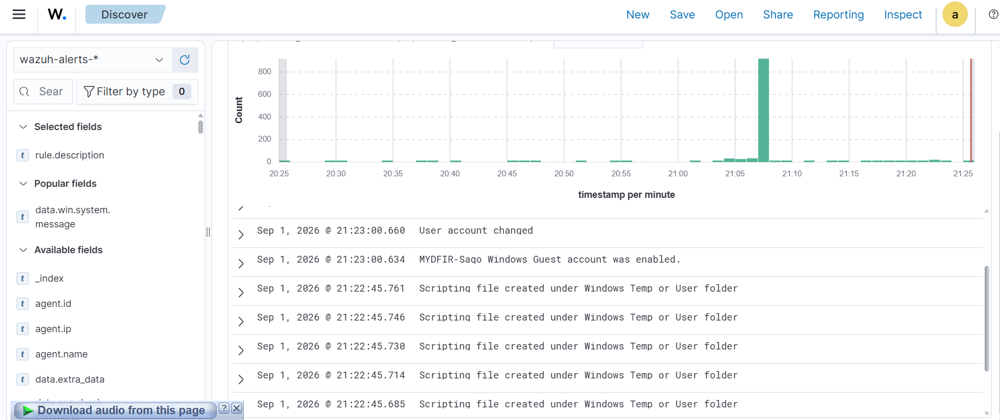

# Wazuh SOC Analyst Lab

A hands-on SOC Analyst lab built using Wazuh to practice security monitoring, log analysis, threat detection, alert investigation, and incident response in a multi-machine virtual environment.

## 🎯 Project Overview

This project was completed as part of the **MYDFIR Wazuh SOC Analyst Challenge**.

The lab focuses on building a small SOC monitoring environment, collecting security telemetry from Windows and Linux systems, analyzing alerts, creating a custom detection rule, and investigating security events using the Wazuh dashboard.

## 🏗️ Lab Environment

The lab consists of:

* **Ubuntu Server** — Wazuh Server
* **Windows 10** — Wazuh Agent
* **Kali Linux** — Wazuh Agent

## 🛡️ Technologies & Tools

* Wazuh
* Wazuh Dashboard
* SIEM
* Windows Event Logs
* Sysmon
* Linux Security Logs
* VMware Workstation
* Windows
* Linux
* Kali Linux

## 🔍 Key Activities

* Deployed and configured a Wazuh server
* Connected Windows and Linux agents
* Monitored security events and system activity
* Analyzed Wazuh alerts and logs
* Worked with Windows security Event IDs
* Installed and used Sysmon for Linux
* Created and tested a custom Wazuh alert
* Investigated security events using the Wazuh dashboard
* Documented investigation findings

## 🚨 Detection & Investigation

The lab included security-event simulations and investigation of generated Wazuh alerts.

The investigation process involved reviewing:

* Event details
* Event timestamps
* Affected hosts
* User/account activity
* Source information
* Alert severity
* Related security events

## 📊 Evidence

### Active Agents

### Wazuh Dashboard

### Detection Alert

### Active Response — IP Block

## 📚 Learning Outcomes

Through this project, I gained practical experience with:

* SOC monitoring
* SIEM operations
* Security log analysis
* Alert investigation
* Windows Event Logs
* Linux telemetry
* Sysmon
* Wazuh rules and alerts
* Basic incident investigation

## 👨‍💻 Project

**MYDFIR Wazuh SOC Analyst Challenge**

This project is part of my ongoing journey toward becoming a **SOC Analyst / Blue Team Security Professional**.
